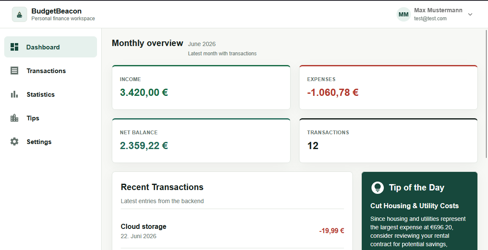
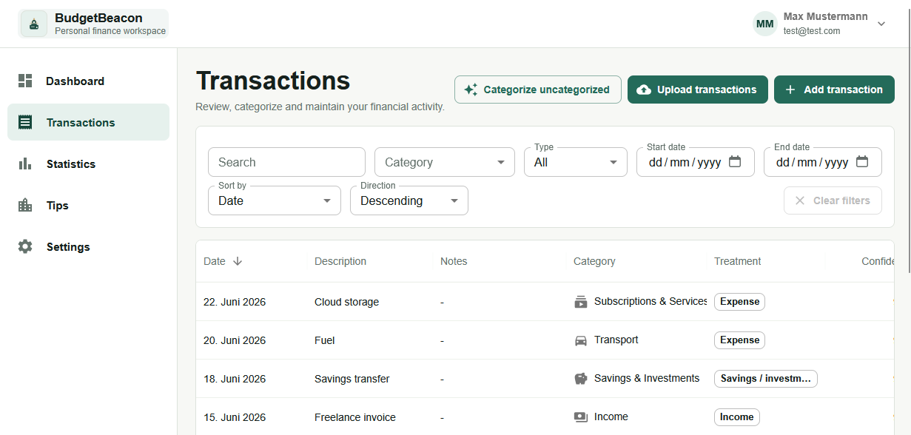
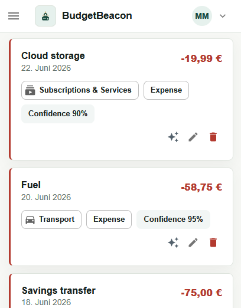
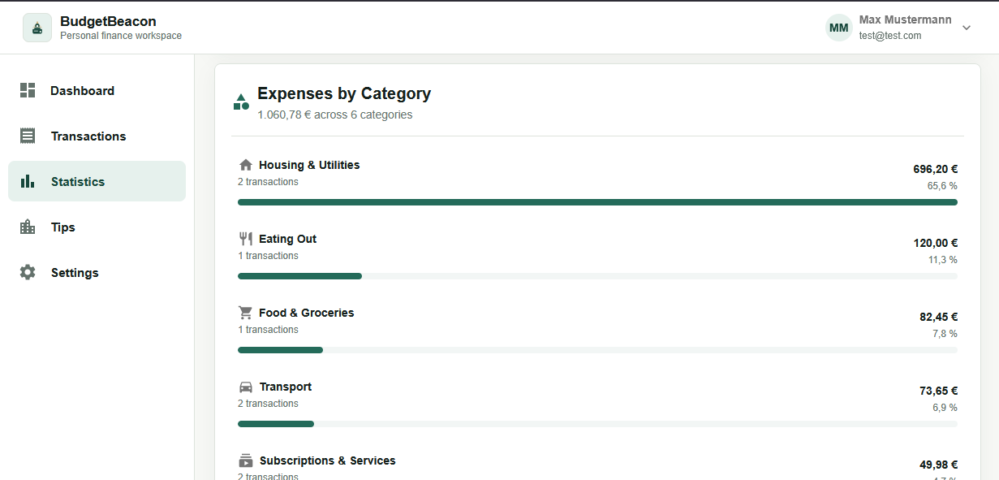
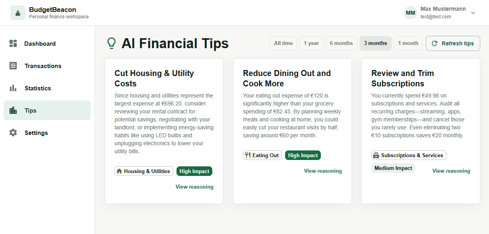

# BudgetBeacon

BudgetBeacon is a full-stack personal finance web app for tracking income and expenses, reviewing spending patterns, and generating AI-assisted saving tips from a user's own transaction data.

## Problem

Personal spending apps often make it hard to move from raw bank exports to useful habits. BudgetBeacon focuses on a practical workflow: import or add transactions, review monthly activity, inspect spending statistics, and get grounded saving suggestions without exposing secrets or running AI calls from the browser.

## Features

- Cookie-based authentication with CSRF protection.
- User-scoped transaction CRUD and CSV/XLSX import.
- Monthly summaries, category breakdowns, trends, recurring expenses, and top expenses.
- AI categorization and saving tips through a backend-only DeepSeek integration.
- Responsive Material UI interface for desktop and mobile.
- Clear loading, empty, error, slow-network, and offline states.
- PostgreSQL persistence with EF Core migrations.
- Health/readiness endpoints and structured API logging with correlation IDs.
- Demo import data in [docs/demo-transactions.csv](docs/demo-transactions.csv).

## Tech Stack

| Area | Technology |
| --- | --- |
| Frontend | React 19, TypeScript, Vite, Material UI, TanStack Query, React Router |
| Backend | ASP.NET Core / .NET 9, ASP.NET Identity, EF Core |
| Database | PostgreSQL |
| AI integration | DeepSeek API behind a Core abstraction |
| Testing | xUnit backend tests |
| Tooling | ESLint, TypeScript build, GitHub Actions, Docker frontend dev compose |

## Screenshots

### Dashboard



### Transactions



<p align="center">
  
</p>

### Spending Statistics



### AI Financial Tips



## Architecture

```text
budgetbeacon-back/
  BudgetBeacon.Api/             HTTP controllers, auth, DI, middleware, health checks
  BudgetBeacon.Core/            entities, models, interfaces, domain services
  BudgetBeacon.Infrastructure/  EF Core, repositories, imports, external API clients
  BudgetBeacon.Tests/           backend unit and API-oriented tests

budgetbeacon-front/
  src/api/                      typed API clients and shared HTTP behavior
  src/components/               reusable UI components
  src/features/                 feature-oriented React code
  src/pages/                    route-level pages
  src/theme/                    Material UI theme
```

Dependency direction is intentionally simple:

```text
Api -> Core
Api -> Infrastructure
Infrastructure -> Core
Tests -> Api/Core/Infrastructure
```

## Local Setup

### Prerequisites

- Node.js 20+
- .NET 9 SDK
- PostgreSQL
- Optional: Docker for the frontend dev container

### 1. Configure Environment

Copy the examples and fill in local values:

```powershell
Copy-Item .env.example .env.local
Copy-Item budgetbeacon-front\.env.example budgetbeacon-front\.env
Copy-Item budgetbeacon-back\BudgetBeacon.Api\appsettings.Development.example.json budgetbeacon-back\BudgetBeacon.Api\appsettings.Development.json
```

Required backend values:

- `ConnectionStrings__DefaultConnection`
- `DeepSeek__ApiKey`
- `DeepSeek__Model`
- `Frontend__AllowedOrigins__0`
- `AccessControl__AllowedEmails__0`

Required frontend values:

- `VITE_API_BASE_URL`
- `VITE_DEV_PROXY_TARGET`

### 2. Restore and Prepare the Backend

```powershell
dotnet tool restore
cd budgetbeacon-back
dotnet restore BudgetBeacon.sln
dotnet tool run dotnet-ef database update --project BudgetBeacon.Infrastructure\BudgetBeacon.Infrastructure.csproj --startup-project BudgetBeacon.Api\BudgetBeacon.Api.csproj --context BudgetBeacon.Infrastructure.Data.BudgetBeaconDbContext
```

### 3. Run the Backend

```powershell
cd budgetbeacon-back\BudgetBeacon.Api
dotnet run
```

Default local API URL: `http://localhost:5078`

Useful endpoints:

- `GET /health/live`
- `GET /health/ready`
- Swagger in development: `/swagger`

### 4. Run the Frontend

```powershell
cd budgetbeacon-front
npm install
npm run dev
```

Default frontend URL: `http://localhost:5173`

### 5. Load Demo Data

Register or sign in, open Transactions, choose Import, and upload [docs/demo-transactions.csv](docs/demo-transactions.csv). Map:

- Date -> `Date`
- Amount -> `Amount`
- Description -> `Description`

## Tests and Checks

Backend:

```powershell
cd budgetbeacon-back
dotnet restore BudgetBeacon.sln
dotnet build BudgetBeacon.sln
dotnet test BudgetBeacon.sln
```

Frontend:

```powershell
cd budgetbeacon-front
npm install
npm run lint
npm run build
```

## Deployment Notes

- Host the API behind HTTPS.
- Provision PostgreSQL and run EF Core migrations.
- Configure `Frontend:AllowedOrigins` for the deployed frontend origin.
- Configure frontend `VITE_API_BASE_URL` for the deployed API.
- Store database credentials and `DeepSeek:ApiKey` in platform secrets.
- Use `/health/ready` for readiness checks.
